# Continuum

**An event-driven context operating system for AI agents.**

Continuum turns privacy-filtered developer activity into evidence-backed semantic checkpoints, then exposes those checkpoints to Codex through a read-only local MCP server. It captures useful state—not screens—so Codex can answer “Continue where I left off” with the relevant goal, blocker, files, commits, decisions, and cited checkpoint IDs without pasted chat history.

Continuum is a **Developer Tools** entry for [OpenAI Build Week](https://openai.devpost.com). The [official rules](https://openai.devpost.com/rules) set the submission deadline at July 21, 2026 at 5:00 PM PDT (July 22 at 5:30 AM IST).

> Codex doesn’t need more memory. It needs better context.

## What the MVP includes

- A Node 24/TypeScript engine on `127.0.0.1:43117`, protected by a generated bearer token.
- Shared Zod contracts for normalized events, checkpoints, context packs, and context diffs.
- Local SQLite storage with FTS5, graph nodes and edges, and optional 384-dimensional sqlite-vec embeddings.
- Hybrid retrieval with hard-bounded Context Packs/MCP diffs and an explicit FTS5-plus-graph degraded path.
- Ollama checkpointing with `gemma3n:e2b` and OpenAI Responses API checkpointing with structured output and `store:false`.
- A read-only stdio MCP server with `current`, `timeline`, `search`, `resume`, and `diff` tools.
- Privacy-first collectors for VS Code, zsh, Git, and foreground allowlisted Chrome tabs.
- A macOS 14+ menu-bar app with authenticated SSE updates, a 15-second polling fallback, fetched privacy audit, GPT briefing action, and Now, Activity, Timeline, Context Diff, Privacy, and Provider Health views.
- A Friday-to-Monday **Synthetic deterministic replay**, visibly labeled by the CLI, API, and native Timeline, for repeatable judging without a model dependency.

## Supported environment

- macOS 14 or later on Apple Silicon
- Node.js 24 and npm
- Xcode Command Line Tools / Swift 5.10 or later
- Optional: Ollama with `gemma3n:e2b`
- Optional: `OPENAI_API_KEY` for OpenAI checkpointing and GPT briefing generation
- VS Code 1.95+, Chrome 114+, Git, and zsh for the live collectors

This is a reproducible source-run build. The MVP is not signed, notarized, or distributed as a DMG.

## Judge quick start

From the repository root:

```sh
./script/bootstrap.sh --demo
```

The bootstrap path installs dependencies, runs verification, creates a fresh project-local demo database, stages `dist/Continuum.app`, launches the menu-bar app, and loads only the synthetic Friday phase. Confirm the Friday state in Timeline, press the Inspector toolbar’s **Mark Caught Up**, then open Context Diff and press **Load Synthetic Catch-Up** to load Monday. Every fixture surface is labeled **Synthetic deterministic replay**.

Synthetic replay is never presented as captured activity. A genuine sanitized four-source trace can be created only from a non-demo project with:

```sh
npm run cli -- export-recording <output.jsonl> [projectId]
```

The exporter refuses demo-contaminated projects, requires VS Code, terminal, Git, and Chrome events, and creates rather than overwrites its output file.

Run the repository verification path separately:

```sh
npm run verify
```

For a component-by-component protocol, expected evidence, and known unverified checks, see [Judge Testing](docs/JUDGE_TESTING.md).

### Recorded verification status

On the development Apple Silicon Mac, the current implementation has passed:

- `npm run verify`: 32 engine tests, 29 collector tests, 6 Swift tests, all builds/type checks, and the read-only MCP subprocess smoke test;
- `./script/build_and_run.sh --verify`: staged app bundle, property list, executable, and daemon health;
- `./script/bootstrap.sh --demo`: the full clean bootstrap path, including a fresh demo database and Friday-phase load;
- `npm run smoke:ollama`: a real schema-valid `gemma3n:e2b` checkpoint;
- `npm audit`: zero known vulnerabilities;
- `npm run benchmark:retrieval`: the correct checkpoint retrieved from 10,000 synthetic checkpoints in **9.4 ms** using explicit FTS5-plus-graph degraded mode;
- an ephemeral `codex exec -m gpt-5.6-sol` handoff: Codex called Continuum `resume` and `diff`, then cited the correct checkpoint, file, commit, resolved blocker, disproven hypothesis, and next action.

These results were measured on the development Apple Silicon Mac. The OpenAI provider smoke test remains unrun because `OPENAI_API_KEY` is not configured. The primary recorded Codex `/feedback` session, screenshots, public video, and public repository submission are still pending.

## Local data and authentication

By default Continuum writes to:

```text
~/Library/Application Support/Continuum/
├── auth.token
└── continuum.sqlite
```

The daemon generates a 32-byte random bearer token, attempts mode `0600` for the token and `0700` for the data directory, and requires that token for every data route. `/health` is the only unauthenticated endpoint. The default host is loopback-only.

Useful environment variables:

| Variable | Purpose |
| --- | --- |
| `CONTINUUM_DATA_DIR` | Override the data directory. |
| `CONTINUUM_DB` | Override the SQLite path, including for MCP. |
| `CONTINUUM_TOKEN` | Supply a bearer token instead of generating one. |
| `CONTINUUM_TOKEN_FILE` | Tell collectors or the app where to read the token. |
| `CONTINUUM_HOST` | Override the daemon host; only `127.0.0.1`, `localhost`, or `::1` is accepted. |
| `CONTINUUM_PORT` | Override port `43117`. |
| `OLLAMA_URL` | Override `http://127.0.0.1:11434`; it must remain loopback HTTP with no credentials, query, or fragment. |
| `OPENAI_API_KEY` | Enable the OpenAI provider; never persisted by Continuum. |
| `CONTINUUM_DISABLE_EMBEDDINGS=1` | Force explicit FTS5-plus-graph degraded retrieval. |

## Codex MCP setup

The repository includes `.codex/config.toml` for this workspace and `.codex/environments/environment.toml`, whose Codex Run action launches `./script/build_and_run.sh`. The MCP configuration calls `script/run_mcp.sh`: it honors an explicit `CONTINUUM_DB`, otherwise follows `.continuum-runtime/active-demo-db` created by the latest bootstrap, and finally falls back to the default database. Build first, then print/regenerate the project-scoped MCP configuration when the clone path changes:

```sh
npm run build
npm run cli -- mcp-config
```

Copy the emitted block into `.codex/config.toml`. It resolves to the built stdio entry point and enables all five Continuum tools. If the database is not at the default path, launch Codex with `CONTINUUM_DB` pointing at it.

Equivalent configuration:

```toml
[mcp_servers.continuum]
command = "/absolute/path/to/Continuum/script/run_mcp.sh"
args = []
cwd = "/absolute/path/to/Continuum"
enabled_tools = ["current", "timeline", "search", "resume", "diff"]
startup_timeout_sec = 10
tool_timeout_sec = 30
```

Restart Codex, then ask only:

```text
Continue where I left off.
```

Continuum’s MCP process opens SQLite read-only with `PRAGMA query_only`, loads sqlite-vec when the initialized vector table is available, reserves stdout for JSON-RPC, and sends diagnostics to stderr. All five tools intentionally omit local-only checkpoints whose source windows contained confidential metadata, because MCP output may be consumed by a cloud agent. MCP reads never acknowledge a checkpoint or move the Context Diff baseline.

The implementation follows the documented local stdio/project-scoped [Codex MCP configuration](https://learn.chatgpt.com/docs/extend/mcp?surface=cli).

## Checkpoint providers

### Local Ollama

The default provider is Ollama and the default model is `gemma3n:e2b`:

```sh
npm run setup:models
npm run doctor
npm run smoke:ollama
```

The provider sends at most 15 already-sanitized events, requests JSON matching the checkpoint schema, makes one repair attempt after invalid JSON or invalid evidence, and serializes all Ollama checkpoint generation at global concurrency one. It does not silently fall back to OpenAI. Other installed Ollama model IDs may be selected manually in Settings.

The real `gemma3n:e2b` smoke test passed on the development machine with a schema-valid checkpoint. This remains a machine-local result; judge hardware and local Ollama configuration can differ.

### OpenAI

Export the API key before launching Continuum:

```sh
export OPENAI_API_KEY="your-key"
./script/build_and_run.sh
npm run smoke:openai
```

The Settings UI offers `gpt-5.6-sol`, `gpt-5.6-terra`, and `gpt-5.6-luna`, with Terra as the default cloud model. The API key remains in the environment. Cloud selection is visible consent for eligible sanitized events; secret and confidential events are never eligible. OpenAI checkpoint generation does not receive a prior local-only checkpoint, and GPT briefing generation refuses a Context Diff containing any local-only checkpoint. Requests use structured output and `store:false`. **`store:false` is not the same as Zero Data Retention.**

Model IDs follow the official [GPT-5.6 model guidance](https://developers.openai.com/api/docs/guides/latest-model?model=gpt-5.6).

Live Ollama and OpenAI calls depend on the judge’s local model/API configuration and are not part of the synthetic replay guarantee. Ollama passed locally; OpenAI live testing remains unrun because no API key is configured.

## Install the live collectors

All collectors send only to loopback HTTP, queue already-sanitized events when the daemon is unavailable, and rely on daemon deduplication for retry safety. Use the canonical repository identity everywhere:

```sh
npm run --silent project-id -- /path/to/repository
```

VS Code, zsh, and Git derive this same 24-character ID when they observe the canonical repository root; Chrome requires the printed value because it cannot inspect the filesystem.

### VS Code

```sh
npm run build -w @continuum/vscode-collector
```

For the source-run MVP, open `collectors/vscode` in VS Code and launch its Extension Development Host. In the target trusted, single-root workspace, run **Continuum: Connect to Local Engine** and paste the contents of `auth.token`. The token is stored in VS Code SecretStorage. Use **Continuum: Retry Pending Events** after an outage.

The extension observes workspace focus, active-file, and save metadata. Paths are workspace-relative; document text is never read. Its durable queue keeps the newest 1,000 sanitized events for at most 24 hours.

### zsh

Source the integration explicitly from `.zshrc`:

```zsh
source '/absolute/path/to/Continuum/integrations/zsh/continuum.plugin.zsh'
```

It uses `preexec`/`precmd` in Terminal.app, iTerm2, and VS Code terminals. Raw command text is passed over stdin to the local sanitizer and immediately reduced to a safe command shape. Leading-space private commands, multiline commands, heredocs, environment assignments, and secret-shaped commands become aggregate counters. Terminal output is never captured. The durable queue keeps the newest 1,000 sanitized events for at most 24 hours.

### Git

From each repository you explicitly want to observe:

```sh
/absolute/path/to/Continuum/integrations/git/install.sh
```

The installer adds repository-local `post-commit`, `post-checkout`, `post-merge`, and `post-rewrite` hooks. It refuses the entire installation if any target hook already exists; it never changes global Git configuration. Events contain SHA, branch, sanitized subject, operation, and up to 50 repository-relative changed paths—never patches, blobs, remotes, or credentials. The repository-local queue keeps the newest 1,000 sanitized events for at most 24 hours.

### Chrome

Open `chrome://extensions`, enable Developer mode, choose **Load unpacked**, and select `collectors/chrome`. In the popup:

1. Paste the output of `npm run --silent project-id -- /path/to/repository`.
2. Add exact allowed domains or explicit `*.example.com` patterns.
3. Paste the local bearer token.
4. Enable capture and approve the optional `tabs` plus localhost permissions.

The extension watches only the active tab in the focused, non-incognito window. It stores the allowlisted host and a sanitized path. Userinfo, query, fragment, email-like segments, high-entropy path segments, page titles, DOM, cookies, and history are not collected. Its durable queue keeps the newest 500 sanitized events for at most 24 hours.

## Data flow

```mermaid
flowchart LR
    A["VS Code / zsh / Git / Chrome"] --> B["Adapter privacy gate"]
    B --> C["Sanitized local retry queue"]
    C --> D["Bearer-authenticated Fastify daemon"]
    D --> E["Daemon allowlist + secret scan"]
    E --> F["SQLite events and 30s / 15-event windows"]
    F --> G["Ollama or OpenAI checkpoint provider"]
    G --> H["Evidence validation"]
    H --> I["Checkpoints + FTS5 + graph + optional vectors"]
    I --> J["Context Pack / Context Diff"]
    J --> K["SwiftUI inspector"]
    J --> L["Read-only Codex MCP"]
```



See [Architecture](docs/ARCHITECTURE.md) and [Privacy](docs/PRIVACY.md) for contracts, route details, retention, and trust boundaries.

## Engine API

| Method | Route | Purpose |
| --- | --- | --- |
| `POST` | `/v1/events/batch` | Validate, filter, deduplicate, and enqueue up to 100 normalized events. |
| `POST` | `/v1/windows/flush` | Checkpoint pending events now. |
| `GET/PATCH` | `/v1/state` | Read health/counters or pause/resume capture. |
| `GET` | `/v1/checkpoints` | List semantic checkpoints. |
| `POST` | `/v1/search` | Build a query-ranked Context Pack. |
| `GET` | `/v1/resume` | Build a bounded resume Context Pack. |
| `GET` | `/v1/diff` | Compute changes from an explicit or acknowledged baseline. |
| `POST` | `/v1/diff/briefing` | Generate an optional OpenAI briefing from a cloud-eligible deterministic diff. |
| `POST` | `/v1/projects/:id/ack` | Set the user-controlled “last cared” checkpoint. |
| `GET/PATCH` | `/v1/settings/models` | Read or change checkpoint provider/model. |
| `GET` | `/v1/privacy` | Read aggregate privacy-rule counters. |
| `GET` | `/v1/stream` | Stream revision notifications over SSE. |
| `POST` | `/v1/demo/replay` | Load `friday`, `monday`, or `all` from the labeled synthetic deterministic replay. |

## Privacy guarantee

Continuum does not capture screenshots, screen video, file or document bodies, terminal output, keystrokes, browser DOM or history, cookies, clipboard contents, Git patches or blobs, remotes, or credentials. A collector can briefly receive a raw command or URL in memory solely to reduce it to an allowlisted shape; raw values are not placed in its retry queue or sent to the daemon.

Secret-classified or secret-shaped events are rejected before event persistence. Collector-generated aggregate drop events are audit-only too: only source, aggregate rule name, action, count, and time enter the privacy audit; they never become activity events, checkpoints, graph entities, or provider input. The daemon repeats schema validation, attribute allowlisting, URL stripping, home-path reduction, and secret detection even when a collector has already sanitized an event.

All normalized event rows, including pending rows, are purged at pipeline startup and by an hourly lifecycle timer 24 hours after daemon receipt. Retention uses trusted `received_at`, not the collector-supplied event timestamp. Checkpoints retain only concise evidence summaries and IDs; evidence-bearing entities also cite valid input event IDs.

Read the precise guarantees and limitations in [Privacy](docs/PRIVACY.md).

## Current MVP limitations

- Vector retrieval is optional. sqlite-vec/table load failure, missing or not-yet-initialized local embedding weights, offline first-run model download, or `CONTINUUM_DISABLE_EMBEDDINGS=1` produces an explicit `fts_graph`/degraded state; search still uses FTS5, graph expansion, importance, and recency.
- Checkpoints have no automatic retention UI in this MVP; they retain concise evidence summaries and event IDs.
- Signing/notarization, remote MCP, cross-device sync, checkpoint deletion controls, and full graph visualization are deferred.
- VS Code and Chrome are source-run/unpacked integrations; no Marketplace or Chrome Web Store package is included.
- The 10,000-checkpoint FTS5-plus-graph benchmark passed at 9.4 ms on the development machine, but it is not a cross-machine or vector-mode performance guarantee.
- Verification includes stable provider error codes without raw model-output snippets, but it does not prove every possible model failure mode.
- OpenAI live generation, the primary recorded Codex `/feedback` session, screenshots/video/publication, and one genuine exported four-collector session remain unproven. The ephemeral Codex MCP resumption test passed locally.

## Repository map

```text
.codex/                 Project MCP config and Codex Run action
collectors/              VS Code and Chrome adapters
integrations/            zsh and repository-local Git adapters
fixtures/                Synthetic deterministic Friday-to-Monday JSONL
native/ContinuumApp/     SwiftPM menu-bar app and tests
packages/contracts/      Shared Zod contracts
packages/continuum/      Engine, providers, retrieval, REST, CLI, and MCP
script/                  Bootstrap and build/run scripts
docs/                    Architecture, privacy, testing, pitch, and demo assets
```

## Submission assets

- [Demo script](docs/DEMO_SCRIPT.md)
- [Devpost draft](docs/DEVPOST.md)
- [Judge testing](docs/JUDGE_TESTING.md)
- [Codex collaboration and decision log](docs/CODEX_COLLABORATION.md)

Screenshots, video, public repository/Devpost publication, and the primary Codex `/feedback` link remain explicit placeholders until those artifacts exist; the repository does not fabricate them.

## License

MIT. See [LICENSE](LICENSE).
