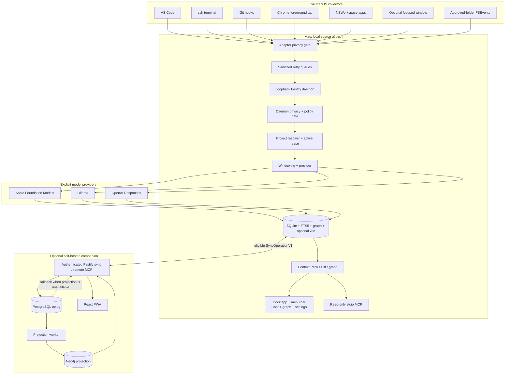

# Continuum live-platform architecture

Continuum is local-first context infrastructure. Its capture unit is an allowlisted semantic event, its durable memory unit is an evidence-backed checkpoint, and its agent-facing unit is a bounded Context Pack, Context Diff, or graph snapshot.

The platform has three sources of truth with intentionally different roles:

- SQLite is the authoritative store for one Mac.
- PostgreSQL is the authoritative synchronized account and operation log.
- Neo4j is a rebuildable projection used for remote graph traversal.

No runtime path seeds data or replays fixtures.

## Topology

The local daemon is the only normal SQLite writer. It binds only to loopback and requires a generated bearer token for every data route; `/health` and the narrow Chrome pairing challenge endpoints are the only unauthenticated exceptions. The local MCP server opens the database read-only and enables `PRAGMA query_only`.

The native app is a regular Dock process with a primary `WindowGroup`, a persistent `MenuBarExtra`, a separate Settings scene, and an `ASWebAuthenticationSession` flow for optional Auth0 synchronization. It receives daemon revisions over authenticated SSE and polls as a reconnect fallback.

## Workspace layout

| Path | Responsibility |
| --- | --- |
| `packages/contracts` | Shared strict Zod contracts for events, context, graph, chat, policy, and sync. |
| `packages/continuum/src/db` | SQLite schema, ordered migrations/backups, FTS5, graph, vector integration, baselines, chat, policy, pairing, and sync queues. |
| `packages/continuum/src/pipeline` | Two-stage privacy enforcement, project resolution, dedupe, active leases, event windows, and checkpoint orchestration. |
| `packages/continuum/src/providers` | Apple helper client, Ollama, OpenAI, chat capabilities, evidence validation, and GPT diff briefing. |
| `packages/continuum/src/retrieval` | Hybrid checkpoint ranking, bounded Context Packs, and deterministic Context Diff. |
| `packages/continuum/src/server` | Loopback authenticated REST/SSE daemon. |
| `packages/continuum/src/mcp` | Read-only stdio MCP with six context tools. |
| `native/ContinuumApp` | SwiftPM Dock/menu-bar app, OS collectors, inspector, chat, graph, Settings, Auth0 PKCE, and Keychain storage. |
| `collectors/vscode` | Trusted single-root VS Code collector. |
| `collectors/chrome` | Paired Manifest V3 foreground-tab collector. |
| `integrations/zsh` | Opt-in `preexec`/`precmd` terminal collector. |
| `integrations/git` | Refuse-overwrite repository-local Git hooks. |
| `packages/cloud` | Authenticated sync, remote context/chat/MCP, PostgreSQL access, and Neo4j projection worker. |
| `apps/web` | Auth0-enabled React/Vite installable PWA. |
| `infra` | Docker Compose and Caddy deployment. |

## Core contracts

### `NormalizedEventV2`

A V2 event contains a global event ID, physical device ID, offset-aware event time, Hybrid Logical Clock (HLC), live source, event type, optional global project UUID, optional hashed local alias/repository fingerprint, sanitized title/attributes, privacy classification, policy revision, relevance, confidence, sync eligibility, and dedupe key.

The live source union is VS Code, terminal, Git, Chrome, or OS. OS event types distinguish application, window, and approved-folder activity. Legacy V1 rows remain readable for migration compatibility, but new collectors emit V2.

Unknown fields fail strict validation. The daemon applies source-specific attribute allowlists after collector-side sanitization. Relevance is auditable `keep`, `drop`, or `uncertain`; it is not a learned opaque classifier.

### Global projects and `ActiveProjectLeaseV1`

Paths are not project identities. Each project has a global UUID. Collectors send a device-local SHA-256 path alias and, when Git history is available, a fingerprint derived from normalized project name and root commit IDs. Absolute paths and remotes do not cross the collector boundary.

Resolution proceeds in this order:

1. accept an explicitly known global UUID;
2. reuse the current device’s local alias mapping;
3. match one project with the same repository fingerprint and normalized name;
4. create a new global project when there is no match;
5. create a provisional project plus a persisted conflict when multiple projects match, then wait for explicit user confirmation.

An active-project lease contains project, project name, authoritative source, confidence, device, and issue/expiry times. VS Code focus and terminal activity have highest authority and a five-minute lease. Git uses a lower-confidence two-minute lease. Approved-folder activity is lower confidence. A confirmed manual selection can use a thirty-minute lease. Chrome reads a lease but never creates or renews one.

### `PrivacyPolicyV1`

The policy has a monotonically increasing revision, source switches, metadata switches, 1–24-hour retention, domain/path rules, cloud eligibility, and literal-true immutable protections. Policy changes propagate through the local revision stream and synchronized operation log.

Queued records are not grandfathered: they are checked again against the current policy before local persistence or remote transmission. On conflict, the stricter effective rule wins.

### `CheckpointV1`

A checkpoint contains goal, focus, summary, progress, blockers, hypotheses, decisions, questions, entities, importance, confidence, provider, model, and timestamps. Blockers are `open` or `resolved`; hypotheses are `active`, `supported`, or `disproven`.

Every factual collection item cites event IDs from the exact provider input window. Unknown evidence IDs reject the provider result and leave the window pending for an explicit retry. Entity evidence is also validated before graph persistence.

### `ContextPackV1` and `ContextDiffV1`

A Context Pack combines the current state with ranked checkpoints, blockers, hypotheses, decisions, questions, files, commits, entities, and ranking provenance. It is capped at 12 checkpoints and 12,000 serialized characters.

Context Diff names both baseline and current checkpoint IDs and returns typed, cited changes: added/resolved blockers, changed hypotheses, new decisions, files, commits, and other entities. The default baseline is the last checkpoint explicitly acknowledged by the user. Reads in the app, API, or MCP never advance it.

### `GraphSnapshotV1`

Graph queries accept project, text, node kinds, edge kinds, a selected node, zero to two hops, cursor, and limit. A snapshot contains stable node/edge IDs, provenance checkpoint IDs, next cursor, truncation flag, and generation time. The contract caps every response at 500 nodes and 1,000 edges.

### Chat contracts

`ChatSessionV1` stores project, classification, and local/cloud eligibility. `ChatMessageV1` stores bounded text, explicit citations, unverified hypotheses, selected provider/model, and eligibility. `ChatRunEventV1` defines SSE start, delta, citation, action, completion, cancellation, and safe error events.

`ContextActionV1` permits only `search_context`, `get_diff`, `select_project`, `create_checkpoint`, and `ack_baseline`. Read actions complete immediately. The last three remain `proposed` until the user confirms them.

The local/native path can execute all three confirmed mutations. The remote path can acknowledge the synchronized baseline, but `create_checkpoint` and `select_project` return `paired_mac_required` because collection/project authority belongs to a connected Mac; no remote command is queued. Cancelling a remote run discards proposals and never persists a completed assistant message.

### `SyncOperationV1`

A sync operation contains a globally unique operation ID, physical device ID, strictly increasing device sequence, HLC, entity type/ID, payload or tombstone, idempotency identity, and occurrence time. Entity types cover projects, events, checkpoints, graph nodes/edges, baselines, policies, settings, devices, and chat.

Immutable entities merge by global ID and reject content replacement or resurrection. Mutable policies/settings use HLC last-write-wins with device ID as a deterministic tie-break. Deletion tombstones remain for 30 days.

## Local persistence and migration

SQLite uses ordered transactional migrations. Before upgrading an existing database, Continuum first purges already-expired raw events and then creates a versioned SQLite backup. The running process schedules removal after 24 hours, and startup cleanup removes overdue backups after downtime.

The migration to live-only storage removes only records whose provenance is exclusively the known runtime fixture source/project/model. Other local events, checkpoints, graph rows, baselines, aliases, and settings are preserved and mapped to global UUIDs.

Major local tables include:

- projects, device-local aliases, project-identity conflicts, and active leases;
- normalized events and event windows;
- checkpoints and FTS5 index;
- graph nodes/edges with stable IDs and checkpoint provenance;
- policy, aggregate privacy audit, model settings, and baselines;
- chat sessions/messages/actions;
- Chrome pairing challenges and hashed collector tokens;
- sync outbox/inbox, HLC entity clocks, cursor, and devices.

Sanitized raw events are purged at startup and periodically using trusted daemon receipt time, constrained by the current policy and never longer than 24 hours. Pending event sync operations are converted to payload-free tombstones at expiry; acknowledged expired event operations are removed.

## Checkpointing and retrieval

Relevant events are grouped by project. A window flushes after 30 seconds of inactivity, 15 events, project switch, or manual checkpoint. Adapter and daemon heuristics apply source enablement, ignored path/domain rules, duplicate suppression, safe-command decisions, and keep/drop/uncertain classification.

The checkpoint provider receives at most 15 already-sanitized events and a bounded prior checkpoint only when that prior evidence is eligible for the provider. Provider output is parsed against the shared schema and evidence references are checked before persistence.

Retrieval combines local MiniLM vectors (50%), FTS5 lexical score (25%), one-hop graph expansion (15%), checkpoint importance (5%), and recency (5%). Results are selected by rank and returned chronologically. If the embedding model or sqlite-vec is unavailable, Continuum exposes `FTS + graph` degradation in state and provenance instead of failing or silently claiming hybrid retrieval.

## Provider boundary

The capability-based registry supports health, structured checkpoint generation, and chat:

- **Apple Foundation Models:** conditional Swift helper, runtime-gated to macOS 26+, Apple Intelligence and locale availability reported verbatim, serialized concurrency one, bounded U.S.-English input framing, guided checkpoint generation, and chat deltas.
- **Ollama:** loopback-only endpoint, selected installed model, global generation concurrency one, JSON schema, and one repair attempt.
- **OpenAI:** Responses API, explicit provider selection, environment-only API key, structured output, and `store:false` without a Zero Data Retention claim.

On a fresh store, Apple is auto-selected only if the initial health probe reports it available; otherwise Ollama remains selected. Once selected, no provider silently falls back to another.

Local chat builds a bounded Context Pack before invoking the selected Apple, Ollama, or OpenAI provider. Secret-shaped user messages are rejected before persistence/provider invocation, and provider text is scanned again before assistant-message persistence. Confidential or local-only sessions cannot use OpenAI. Remote PWA chat instead composes a bounded cited answer from synchronized checkpoints; it has no device collector or local-model access.

## Local API

Except where noted, routes require the generated local bearer token.

| Method | Route | Purpose |
| --- | --- | --- |
| `GET` | `/health` | Unauthenticated process health only. |
| `GET/PATCH` | `/v1/state` | Inspector state and capture pause/resume. |
| `POST` | `/v1/events/batch` | Strict batch ingestion, project resolution, policy filtering, dedupe, and windowing. |
| `GET` | `/v1/projects/active` | Current unexpired project lease. |
| `GET` | `/v1/projects/identity/conflicts` | Pending or completed ambiguous clone matches. |
| `POST` | `/v1/projects/identity/conflicts/:id/confirm` | Confirm one candidate global project. |
| `POST` | `/v1/windows/flush` | Flush a project window. |
| `GET` | `/v1/checkpoints` | List checkpoints. |
| `POST` | `/v1/search` | Build a bounded query-ranked Context Pack. |
| `GET` | `/v1/resume` | Build a bounded current Context Pack. |
| `GET` | `/v1/diff` | Compute deterministic cited change. |
| `POST` | `/v1/diff/briefing` | Optional OpenAI briefing for a fully eligible diff. |
| `POST` | `/v1/projects/:id/ack` | Move the user-controlled baseline. |
| `GET/PATCH` | `/v1/settings/models` | Provider/model settings and health. |
| `GET/PATCH` | `/v1/settings/privacy` | Versioned privacy policy. |
| `GET` | `/v1/privacy/audit` | Aggregate-only audit entries. |
| `POST` | `/v1/graph/query` | Bounded graph snapshot. |
| various | `/v1/chat/...` | Sessions, messages/SSE runs, cancellation, and action confirm/reject. |
| various | `/v1/pairing/chrome/...` | Five-minute challenge request, app approval, status, and revocation. |
| various | `/v1/settings/sync`, `/v1/sync/...` | Remote configuration, status, push/pull, reconnect, devices, and revocation. |
| `GET` | `/v1/stream` | Revision SSE stream. |

The paired Chrome token is accepted only for Chrome event ingestion, active-lease reading, and privacy-policy reading. It cannot invoke general daemon routes or submit another source.

## MCP transports

The transport-independent context operations are `current`, `timeline`, `search`, `resume`, `diff`, and `graph`. Each has bounded input/output schemas, structured JSON plus compatibility text, checkpoint provenance, read-only annotations, and explicit unverified-hypothesis guidance.

The local stdio server opens SQLite read-only and filters to cloud-eligible checkpoint/context rows. The remote Streamable HTTP server uses the same semantics against the authenticated tenant’s synchronized PostgreSQL/Neo4j view. Neither transport can create checkpoints, acknowledge baselines, change settings, or mutate the graph.

## Synchronization, authentication, and projection

The local sync client sends only currently eligible operations. Before every push it re-evaluates event, checkpoint, graph, baseline, and chat eligibility; ineligible pending records become payload-free tombstones. Pull pages continue until `hasMore` is false, even if a page contains only the current device’s operations.

The service validates operation structure, tenant, sequence, HLC, source-specific privacy, expiration, eligibility, and immutable collisions before PostgreSQL persistence. PostgreSQL owns the account oplog and materialized synchronized entities. Sync continues while Neo4j is down.

The projection worker reads a PostgreSQL outbox idempotently. Graph status exposes projection degradation/lag. Neo4j can be rebuilt completely from authoritative PostgreSQL state.

Authentication boundaries:

- Auth0 access tokens must match configured issuer, audience, and scopes.
- PWA and native app use Authorization Code with PKCE; the native refresh credential lives only in Keychain.
- Remote MCP publishes OAuth protected-resource metadata and uses the `context:read` scope.
- Copy-once API keys use `ctm_<id>_<secret>`. PostgreSQL stores only a peppered HMAC-SHA-256 digest plus account, scopes, expiry, revocation, device binding, and last-used metadata.
- An API key binds transactionally to its first sync device. Cross-device reuse is rejected, and revoking the device revokes all keys bound to it.
- Every data query is tenant-scoped by the authenticated account; clients cannot select another tenant ID.

### Remote API surface

| Method | Route group | Scope/purpose |
| --- | --- | --- |
| `GET` | `/health` | Unauthenticated service health. |
| `GET` | `/.well-known/oauth-protected-resource[/mcp]` | MCP OAuth resource metadata and supported scopes. |
| `GET` | `/v1/state`, `/v1/projects/active`, `/v1/checkpoints` | Authenticated synchronized overview/context. |
| `GET/PATCH` | `/v1/settings/privacy`, `/v1/settings/models` | Versioned policy/model settings. |
| various | `/v1/chat/...` | Synchronized sessions, grounded SSE response, cancellation, and bounded actions. |
| `POST` | `/v1/sync/push`, `/v1/sync/pull` | Device-sequenced eligible operation exchange. |
| various | `/v1/sync/status`, `/v1/sync/reconnect`, `/v1/sync/devices` | Sync health, reconnect, presence, and device revocation. |
| various | `/v1/api-keys`, `/v1/auth/api-keys` | Copy-once scoped key creation/list/revocation. |
| `GET/POST` | `/v1/context/...`, `/v1/graph/query` | Bounded tenant-scoped context and graph. |
| `POST/GET/DELETE` | `/mcp` | Stateless authenticated Streamable HTTP MCP. |

Routes require the corresponding `context:read`, `sync:read`, `sync:write`, `devices:write`, or `keys:write` scope. Compatible MCP clients can use Auth0 Dynamic Client Registration when the deployment operator enables it in the Auth0 tenant; Continuum itself does not store an OAuth client secret.

## PWA and native graph

The native graph uses SwiftUI Canvas with deterministic off-main layout, pan/zoom, search, filters, fit/reset, bounded expansion, selection provenance, and an Open in Chat handoff.

The PWA uses TanStack Query, Graphology, and Sigma.js on desktop. Mobile uses a simplified graph and selected-node bottom sheet. Now, Chat, Graph, Timeline, Privacy, Devices, and Settings are responsive, keyboard reachable, reduced-motion aware, high-contrast compatible, and system light/dark aware. The PWA never registers a collector.

## Availability is not one status

The UI reports these independently:

- local engine connection;
- each collector/permission state;
- selected checkpoint/chat provider health;
- vector retrieval availability;
- remote sync/authentication state;
- Neo4j projection health and lag.

A missing embedding model must not make live capture look offline. A missing Neo4j projection must not stop synchronization. A provider outage must not cause a provider switch.

## Deliberate boundaries

This release excludes screenshots, content capture, Endpoint Security extensions, remote shell/file access, signing/notarization, App Store distribution, and zero-knowledge end-to-end encryption. The self-hosted service processes eligible plaintext context for synchronized search, projection, chat, and MCP over TLS.

Neo4j is used instead of Kùzu because the [Kùzu repository is archived](https://github.com/kuzudb/kuzu). The local runtime still avoids requiring Neo4j: SQLite remains the local source of truth.
