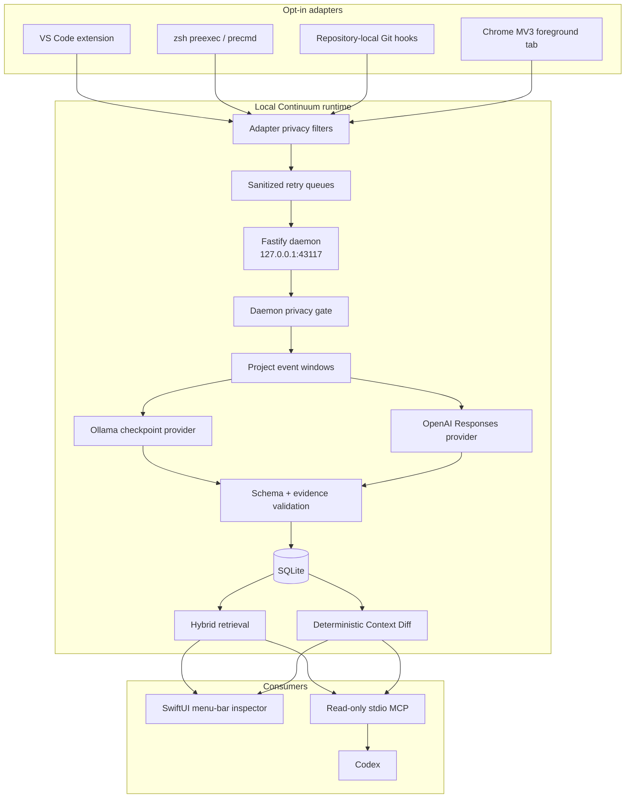

# Continuum MVP Architecture

Continuum is a local context infrastructure layer for developer tools. Its unit of capture is an allowlisted semantic event; its unit of memory is an evidence-backed checkpoint; its public agent interface is a bounded Context Pack or Context Diff.

## Runtime topology

The engine, database, model providers, and native app are separate processes. The daemon is the only writer. `script/build_and_run.sh` launches it in a detached OS session so it survives the Codex Run shell, verifies that the new PID owns the listening port, and stops a stale listener only when its command and repository working directory identify it as this Continuum engine. `CONTINUUM_HOST` accepts only `127.0.0.1`, `localhost`, or `::1`; it cannot expose the daemon on a LAN interface. The MCP process opens the selected SQLite database with Node’s read-only flag and `PRAGMA query_only = ON`.

## Workspace layout

| Path | Responsibility |
| --- | --- |
| `packages/contracts` | Zod schemas and inferred TypeScript types. |
| `packages/continuum/src/pipeline` | Daemon privacy gate, deduplication, windowing, and checkpoint orchestration. |
| `packages/continuum/src/db` | SQLite schema, FTS5, graph, optional sqlite-vec, settings, baselines, and privacy audit. |
| `packages/continuum/src/providers` | Deterministic fixture provider, Ollama, OpenAI, evidence validation, and diff briefing. |
| `packages/continuum/src/retrieval` | Local MiniLM embeddings, ranking, Context Pack limits, and Context Diff. |
| `packages/continuum/src/server` | Authenticated Fastify API and SSE revision stream. |
| `packages/continuum/src/mcp` | Read-only stdio MCP server. |
| `native/ContinuumApp` | macOS menu-bar shell, inspector, settings, and daemon client. |
| `collectors` / `integrations` | Source-specific collectors and their first privacy boundary. |

## Core contracts

### `NormalizedEventV1`

Each event has:

- contract version, event ID, offset-aware event time, source, and event type;
- project ID and optional session ID;
- a sanitized title and source-specific allowlisted attributes;
- privacy classification (`public`, `personal`, `confidential`, or `secret`) and applied rules;
- relevance decision (`keep`, `drop`, or `uncertain`), reason, confidence, and optional dedupe key.

The ingestion endpoint accepts 1–100 events per batch. Unknown top-level fields fail the strict Zod schema. Source-specific attribute allowlisting happens inside the daemon even after the adapter boundary.

### `CheckpointV1`

A checkpoint records the project and window plus goal, focus, summary, progress, blockers, hypotheses, decisions, questions, entities, importance, confidence, provider, model, and creation time.

Blockers are `open` or `resolved`. Hypotheses are `active`, `supported`, or `disproven`. Every progress item, blocker, hypothesis, decision, question, and entity must cite at least one event ID supplied to the provider. Entity evidence is extracted deterministically from the sanitized window rather than trusted from model output. Any unknown evidence ID rejects the checkpoint and leaves the window available for retry.

### `ContextPackV1`

A pack contains current goal/focus, ranked checkpoints, blockers, hypotheses, decisions, questions, files, commits, graph entities, ranking provenance, degraded state, and approximate serialized size. It returns at most 12 checkpoints and at most 12,000 serialized characters. Selected checkpoints are returned in chronological order after ranking.

### `ContextDiffV1`

A diff identifies the baseline and current checkpoint, then emits cited changes for added/resolved blockers, changed hypotheses, decisions, files, and commits. The baseline comes from an explicit `sinceCheckpointId` or the last checkpoint the user acknowledged in the native app. Reads never change it. The optional GPT briefing is generated from the already-computed diff and does not replace the deterministic change list.

## Ingestion and windowing

The daemon performs this sequence:

1. Parse the strict event contract.
2. Reject `secret`, secret-shaped, or explicitly irrelevant events.
3. Strip non-allowlisted attributes and sanitize retained strings/URLs.
4. Deduplicate by event ID and the partial unique `(project_id, dedupe_key)` index.
5. Group accepted events by project.
6. Flush after 15 events, after a 30-second idle timer, on project switch, or on `POST /v1/windows/flush`.
7. Ask the selected provider for a structured checkpoint.
8. Validate its schema and every evidence reference.
9. Persist the checkpoint, FTS row, graph edges, and optional embedding.

Project switches flush the prior project before accepting the new project’s event. Ollama generation is globally serialized at concurrency one; other pipeline work remains asynchronous. A provider failure marks the run failed, resets its sanitized events to pending, and requires a later timer/manual retry; there is no silent provider fallback. Persisted failures use stable codes such as `provider_aborted`, `provider_invalid_response`, `provider_invalid_evidence`, `provider_http_error`, or `provider_failed`; raw model-output or exception snippets are not stored.

VS Code, zsh, and Git resolve the same canonical project identity from the canonical repository-root path. Chrome receives the copyable value from `npm run --silent project-id -- /path/to/repository`, because an extension cannot resolve the local repository root.

## Checkpoint providers

### Deterministic fixture provider

The fixture provider is not an AI model. It deterministically maps labeled fixture event types into progress, blockers, hypotheses, decisions, and evidence-bearing entities. It is used to make replay, privacy assertions, MCP behavior, and Context Diff reproducible. CLI/API output and native Timeline label it **Synthetic deterministic replay**; persisted checkpoints identify their provider as `deterministic` and model as `fixture-rules-v1`.

A genuine trace is a separate export path: `npm run cli -- export-recording <output.jsonl> [projectId]`. The exporter refuses a project containing demo events, requires all four live sources, and uses exclusive file creation. Synthetic fixture data is therefore never relabeled as captured activity.

### Ollama

- Default model: `gemma3n:e2b`.
- Endpoint: `OLLAMA_URL`, default `http://127.0.0.1:11434`; only loopback HTTP URLs without credentials, query, or fragment are accepted.
- Input bound: at most 15 sanitized events and a 4,096-token model context setting.
- Output: JSON schema derived from `CheckpointDraftSchema`.
- Recovery: one repair attempt; otherwise the window remains pending.
- Concurrency: one global Ollama generation at a time.
- Fallback: none. Another Ollama model must be selected explicitly.

### OpenAI Responses API

- Default cloud model: `gpt-5.6-terra`.
- Presets: `gpt-5.6-sol`, `gpt-5.6-terra`, and `gpt-5.6-luna`; arbitrary non-empty IDs are accepted by the advanced API contract.
- Structured output: `zodTextFormat(CheckpointDraftSchema, "checkpoint")`.
- Storage request: `store:false`.
- Credential: `OPENAI_API_KEY` environment variable only.
- Eligibility: only sanitized `public` and `personal` events; `confidential` events stay local and `secret` events never persist. Prior local-only checkpoint text is excluded, and a Context Diff containing any local-only checkpoint is refused for GPT briefing.
- Fallback: none.

Provider health for OpenAI currently means “API key configured,” not a live API round trip. Ollama health queries `/api/tags` with a short timeout.

## Persistence

SQLite tables cover migrations, settings, projects, events, windows, checkpoints, graph nodes/edges, provider runs, and aggregate privacy audit records. Collector `privacy.drop.aggregate` payloads are consumed into aggregate audit rows and never persisted as events or sent to checkpoint providers. FTS5 indexes goal, focus, summary, and checkpoint items with `porter unicode61` tokenization.

Graph edges connect project → checkpoint and checkpoint → entity. Entity kinds include project, task, file, commit, URL, error, person, concept, decision, and blocker. Relations currently include `HAS_CHECKPOINT`, `TOUCHES`, `BLOCKED_BY`, `DECIDES`, and `MENTIONS`.

All normalized event rows whose daemon `received_at` is older than 24 hours, including pending/uncheckpointed rows, are purged when the event pipeline starts and by an hourly lifecycle timer. The collector-supplied `occurredAt` is not trusted for expiry. Checkpoints retain compact evidence summaries and event IDs. Checkpoints do not yet have automatic retention or deletion controls.

## Retrieval

For a query, the ranking components are:

| Signal | Weight |
| --- | ---: |
| local vector rank | 50% |
| FTS5 lexical rank | 25% |
| one-hop graph expansion | 15% |
| checkpoint importance | 5% |
| recency | 5% |

The implementation applies reciprocal rank contributions for vector, lexical, graph, and recency signals, then adds the importance contribution. It ranks candidates, keeps at most 12, orders the selected set chronologically, and removes oldest selected entries until the serialized pack fits the requested limit. If a single checkpoint is still too large, it is compacted; as a final fallback the checkpoint list is removed so the requested Context Pack bound remains hard. MCP `diff` similarly removes the largest result arrays until it fits `maxChars` and marks truncation.

Embeddings use `onnx-community/all-MiniLM-L6-v2-ONNX` through the local Transformers runtime and must be 384-dimensional. The writable daemon enables extension loading and initializes the sqlite-vec table; read-only MCP loads sqlite-vec and uses that table when present. sqlite-vec or embedding-model failure/non-initialization is non-fatal: state reports `fts_graph`, pack provenance sets `degraded: true`, and retrieval continues with FTS5, graph, importance, and recency. The first embedding-model load may require a download unless weights are already cached.

`npm run benchmark:retrieval` seeds 10,000 synthetic checkpoints into a temporary database and verifies retrieval of a known lexical checkpoint. The measured development-machine run completed retrieval in 9.4 ms in explicit FTS5-plus-graph mode, below the 500 ms target. This is a local measurement, not a vector-mode or cross-machine guarantee.

## Daemon interface

All routes except `/health` require `Authorization: Bearer <token>`.

| Route | Contract |
| --- | --- |
| `POST /v1/events/batch` | `{ events: NormalizedEventV1[] }` → accepted/duplicate/dropped/secret counts. |
| `POST /v1/windows/flush` | Optional `projectId` → created checkpoints. |
| `GET /v1/state` | Counters, active project, capture state, retrieval mode, provider health, and model settings. |
| `PATCH /v1/state` | `{ capturePaused: boolean }`. |
| `GET /v1/checkpoints` | Optional `projectId` and bounded `limit`. |
| `POST /v1/search` | Query/project/character bound → Context Pack. |
| `GET /v1/resume` | Project/character bound → Context Pack. |
| `GET /v1/diff` | Project/explicit baseline → deterministic Context Diff. |
| `POST /v1/diff/briefing` | Context Diff → optional OpenAI briefing. |
| `POST /v1/projects/:id/ack` | Explicit/latest checkpoint → stored baseline. |
| `GET/PATCH /v1/settings/models` | Provider/model settings and health. |
| `GET /v1/privacy` | Aggregate audit and counters. |
| `GET /v1/stream` | SSE `revision` event once per second. |
| `POST /v1/demo/replay` | Labeled synthetic replay with `friday`, `monday`, or `all` phase. |

## MCP interface

| Tool | Result |
| --- | --- |
| `current({ projectId? })` | Latest bounded context, capped at 8,000 characters. |
| `timeline({ projectId?, cursor?, limit? })` | A cursor-paginated page of up to 50 recent semantic checkpoints. |
| `search({ query, projectId?, limit? })` | Query-ranked Context Pack, capped at 12 checkpoints / 12,000 characters. |
| `resume({ projectId?, maxChars? })` | Bounded resumption Context Pack. |
| `diff({ projectId?, sinceCheckpointId?, maxChars? })` | Cited deterministic changes; truncates the change list when necessary. |

Every tool returns structured JSON and compatibility text. Tool annotations declare read-only, non-destructive, idempotent, closed-world behavior. The MCP instructions tell Codex to cite checkpoint IDs and treat hypotheses as unverified. The MCP view is deliberately cloud-safe: every query filters out a checkpoint whose source window contained any confidential event, while the native local inspector can still show it. This prevents local-only state from crossing the MCP boundary if Codex uses a cloud model.

Project configuration invokes `script/run_mcp.sh`. An explicit `CONTINUUM_DB` wins; otherwise the wrapper follows the latest bootstrap database pointer in `.continuum-runtime/active-demo-db`, then falls back to the default database. Each demo bootstrap creates a fresh project-local data directory, so repeated judging cannot inherit a stale baseline or deduplicated fixture.

## Native app

`ContinuumApp` is an intentional `.accessory` process with `LSUIElement=true`, so it has no Dock icon. `MenuBarExtra` provides status, provider/model, pending count, capture pause/resume, manual checkpoint, Catch Up, Inspector, Settings, and Quit.

The singleton inspector has Now, Activity, Timeline, Context Diff, Privacy, and Provider Health sections. Timeline labels fixture checkpoints **Synthetic deterministic replay**. Privacy fetches the aggregate audit endpoint. “Mark Caught Up” writes the explicit baseline; **Load Synthetic Catch-Up** loads the Monday phase; and Context Diff offers **Generate GPT Briefing** when the diff is cloud-eligible. The Settings scene controls loopback daemon URL, capture state, checkpoint provider, and model.

The native client authenticates to `/v1/stream`, refreshes on SSE revision events, retries a broken stream after two seconds, and keeps a 15-second polling loop as fallback. It reports disconnected and degraded/reconnecting states rather than hiding retrieval/provider failures.

## Deliberate deferrals

Finder, clipboard, Slack, Calendar, Android, browser content scripts, terminal output, screenshots, OS-wide monitoring, cross-device sync, custom activity-model training, Neo4j/Kùzu, remote MCP, signing/notarization, DMG distribution, and a full interactive graph view are outside the Build Week MVP.
