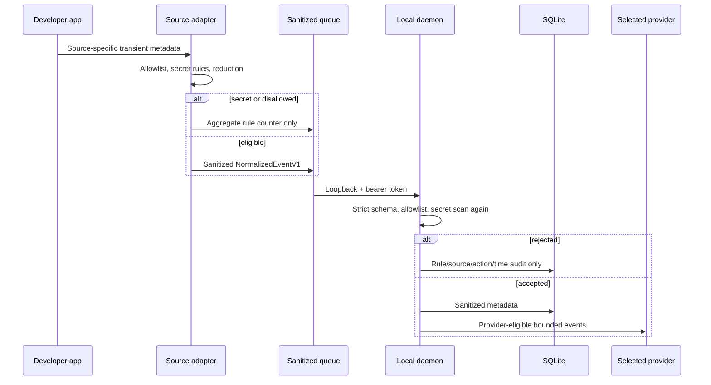

# Continuum Privacy Model

Continuum is designed around data minimization: collect the smallest useful semantic event, reject secrets twice, keep raw observation local and transient, and expose agents only to bounded evidence-backed checkpoints.

## Guarantees

Continuum does **not** capture or persist:

- screenshots, screen recordings, or accessibility-tree snapshots;
- file contents, document bodies, editor selections, or unsaved text;
- terminal output, shell history, or individual keystrokes;
- browser DOM, page content, page titles, history, cookies, or form data;
- clipboard contents;
- Git patches, diffs, blobs, remotes, or credentials;
- environment-variable values or API keys.

The zsh adapter briefly receives the submitted command string in its process memory so it can classify and reduce it to a safe shape. The Chrome adapter briefly receives the active tab URL so it can reconstruct an allowlisted origin/path. Those raw values are not written to retry queues or transported to the daemon.

## Two privacy boundaries



### Boundary 1: inside each adapter

Each collector has a source-specific allowlist and creates a `NormalizedEventV1` only after sanitization. Failed delivery queues contain already-sanitized events.

### Boundary 2: before daemon persistence

The daemon re-parses the strict schema, rejects explicit `secret` classification and secret-shaped strings, strips every non-allowlisted attribute, sanitizes control characters and home-directory prefixes, removes URL userinfo/query/fragment, and checks the sanitized result again.

An accepted event is marked with `daemon_allowlist_v1` and `daemon_secret_scan_v2`. A rejected secret records only source, rule name, action, count, and audit time—not the secret event or value. Likewise, a collector’s `privacy.drop.aggregate` event is consumed directly into the audit counter: it is never stored as an activity event, checkpointed, embedded, graphed, or sent to a provider.

## Source-specific collection

| Source | Retained | Dropped or never read |
| --- | --- | --- |
| VS Code | Trusted single-root workspace focus; workspace-relative active/saved file path; language ID; sanitized workspace label. | Document text, selections, outside-workspace paths, `.env`, key/credential paths, generated directories. |
| zsh | Executable/safe subcommand shape, repository-relative cwd, project name, duration, exit code, terminal session identifier. | Output, full arbitrary arguments, leading-space private commands, multiline commands, heredocs, assignments, secret-shaped commands and paths. |
| Git | Commit SHA, branch, operation, sanitized subject, at most 50 repository-relative changed paths. | Patch/diff content, blobs, remotes, credentials, secret paths/subjects. |
| Chrome | User-allowlisted host and reconstructed HTTP(S) path for the foreground tab in the focused window. | Userinfo, query, fragment, email/high-entropy/secret path segments, titles, DOM, page content, cookies, history, background and incognito tabs. |

Chrome’s `tabs` and localhost host permissions are optional and requested only after the user presses **Connect and save**. The manifest declares incognito `not_allowed` and has no content script or history permission.

## Classification and provider eligibility

| Classification | Persist as an event | Eligible for local Ollama | Eligible for OpenAI |
| --- | ---: | ---: | ---: |
| `public` | Yes, after both gates | Yes | Yes, when OpenAI is selected |
| `personal` | Yes, after both gates | Yes | Yes, when OpenAI is selected |
| `confidential` | Yes, after both gates | Yes | No |
| `secret` | No | No | No |

Selecting OpenAI is treated as visible consent for eligible sanitized events. There is no per-request confirmation in the MVP. Continuum never silently falls back from local to cloud. OpenAI checkpointing starts without prior local checkpoint text, and GPT briefing refuses any Context Diff whose checkpoint set contains local-only evidence. The read-only MCP view also omits every checkpoint whose source window was not entirely cloud-eligible, because its output may be consumed by a cloud model; those checkpoints remain visible in the native local inspector.

OpenAI requests use the Responses API with structured output and `store:false`. `OPENAI_API_KEY` is read from the environment and never written by Continuum. `store:false` must not be represented as Zero Data Retention; any applicable OpenAI account, API, and legal terms remain controlling.

## Secret rules

The daemon rejects common forms including:

- OpenAI-style `sk-…` values;
- API-key, access-token, password, and secret assignments;
- private-key headers;
- Authorization header values;
- `.env` paths;
- the deterministic fixture canary `CONTINUUM_DEMO_SECRET_SHOULD_NEVER_APPEAR`.

Collectors add stricter source-specific rules. Rule-based detection reduces risk but cannot prove detection of every possible secret format. Users should still avoid intentionally putting secrets into file names, branch names, or commit subjects.

## Data lifecycle

### In-memory source payloads

Raw command strings and tab URLs exist only long enough for adapter sanitization. File contents, terminal output, and browser content are never requested.

### Collector retry queues

- VS Code: sanitized JSON under extension global storage; token in SecretStorage; newest 1,000 events, maximum age 24 hours.
- zsh: sanitized session/queue JSON under `~/.continuum/zsh`, created with restrictive modes; newest 1,000 queued events, maximum age 24 hours.
- Git: sanitized per-event JSON under that repository’s `.git/continuum/queue`; newest 1,000 queued events, maximum age 24 hours.
- Chrome: sanitized events in extension local storage; token in browser session storage; newest 500 events, maximum age 24 hours.

Entries are removed after successful daemon delivery. All four collectors physically prune invalid/expired entries before queue persistence or a delivery attempt. Events at the exact 24-hour boundary remain eligible; older events are deleted.

### Daemon database

The default SQLite database is `~/Library/Application Support/Continuum/continuum.sqlite`. All normalized event rows received by the daemon more than 24 hours earlier, including pending/uncheckpointed rows, are deleted when the event pipeline starts and by an hourly lifecycle timer. Expiry is based on trusted database `received_at`, not the collector-supplied `occurredAt`; far-future event times are also clamped at ingestion.

Checkpoints retain concise evidence text, event IDs, project/window IDs, evidence-bearing entities, provider/model, and timestamps. Every retained entity cites one or more valid input event IDs. They do not retain file bodies or raw provider prompts. Checkpoints, provider-run metadata, graph rows, and privacy audit rows have no automatic expiry or deletion UI in the MVP.

### Embeddings

Embeddings are computed locally from checkpoint goal, focus, summary, blockers, hypotheses, and decisions. No raw event body is embedded. If the local MiniLM runtime or sqlite-vec is unavailable, vector insertion/search is skipped and the explicit degraded mode is used.

## Authentication and transport

- The daemon defaults to `127.0.0.1:43117`; `CONTINUUM_HOST` accepts only `127.0.0.1`, `localhost`, or `::1`.
- `OLLAMA_URL` must be loopback HTTP and may not contain credentials, a query, or a fragment.
- A generated random bearer token is required for all data routes; only `/health` is public.
- The default data directory and token modes are tightened to `0700` and `0600` where the filesystem permits.
- zsh and Git validate that their endpoint is loopback HTTP with no URL credentials.
- VS Code transport rejects non-loopback endpoints.
- Chrome requests only its two loopback host origins.
- MCP is local stdio, opens SQLite read-only with `PRAGMA query_only`, can load the already-initialized sqlite-vec table without making database writes, and exposes only cloud-safe checkpoints.

The API currently returns `Access-Control-Allow-Origin: *`; bearer authentication is therefore the enforcement boundary for browser-origin requests. A malicious process running as the same macOS user and able to read the token or database is outside this MVP’s isolation boundary.

## Evidence integrity

Checkpoint facts must cite event IDs supplied to the selected model. Unknown IDs fail validation before checkpoint persistence. Entities are extracted from sanitized event metadata with their own evidence IDs rather than accepted as unsupported model claims. Blockers and hypotheses retain explicit status, and the MCP server instructs clients to treat hypotheses as unverified.

Evidence IDs prove grounding to accepted input metadata; they do not independently prove that the source application’s semantic label was true. Continuum is context infrastructure, not a tamper-proof audit log.

## Privacy verification

The **Synthetic deterministic replay** intentionally contains a secret canary. Core tests assert the canary exists in the source fixture but appears nowhere in persisted events or checkpoints. Adapter suites cover secret paths, URL stripping, private commands, secret-shaped commit metadata, durable sanitized queues, and Git hook overwrite refusal. A genuine sanitized trace is produced only by `npm run cli -- export-recording <output.jsonl> [projectId]`; that exporter refuses demo-contaminated projects and requires all four live sources.

Run:

```sh
npm run verify
npm --prefix collectors/chrome run verify
npm --prefix integrations/zsh run verify
npm --prefix integrations/git run verify
```

The measured `npm run verify` pass includes 32 engine tests, including received-at event expiry, cloud-boundary/MCP isolation, local-only diff refusal, stable provider error codes, aggregate-only drops, evidence-bearing entities, secret rejection, and canary absence; it also includes 29 collector tests and 6 Swift tests. `npm audit` reported zero known vulnerabilities. Before a public submission, still inspect the database and daemon logs from a genuine collector session using synthetic secrets. These tests are not a substitute for reviewing the final captured trace.

## Threat model limitations

- Heuristics cannot recognize all secrets or sensitive business context.
- Local malware or another process with the user’s filesystem privileges can access local queues/database.
- Checkpoint deletion controls are not implemented; all collector retry queues enforce 24-hour expiry.
- The source-run app is not signed, notarized, hardened, or sandboxed.
- OpenAI eligibility is controlled by classification plus provider selection, not a per-request consent dialog.
- There is no encryption-at-rest layer beyond macOS user/file permissions.
